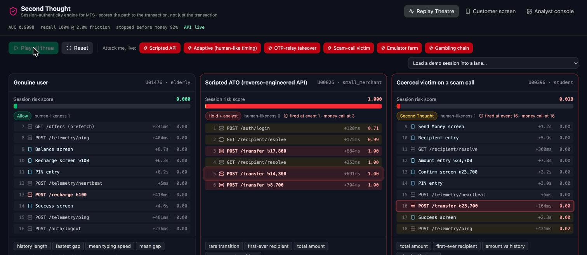

# Second Thought — Session-Authenticity Engine for Mobile Financial Services

**AI Hackathon 2026 · DIU CPC × upay · Track 01 Trust & Risk Intelligence (account takeover + scam intelligence)**

<h2 align="center">Fraud models score the <em>transaction</em>.<br>Second Thought scores the <em>path to the transaction</em>.</h2>

<p align="center">
  <a href="https://secondthought.dubd.site"></a>
  &nbsp;
  <a href="deck/SecondThought-deck.pdf"></a>
  &nbsp;
  <a href="IDEA.md"></a>
</p>

<p align="center"><b>🔗 Live demo: <a href="https://secondthought.dubd.site">https://secondthought.dubd.site</a></b> · live model + live "Attack me" simulation (full stack in one container) · mirror: <a href="https://second-thought-pink.vercel.app">second-thought-pink.vercel.app</a> (static snapshot) · <a href="STRATEGY.md">strategy &amp; threat model</a> · <a href="PROMPT.md">every prompt used</a></p>

> By the time a transaction model sees the transfer, the attacker already owns the session. The sequence of API calls and screens, the timing between them, the telemetry the genuine app always emits, and how all of that compares with *this user's own history* are visible **5–10 events earlier**. Second Thought scores that path, event by event, and intervenes **before `POST /transfer` executes**.



## The problem

Bangladeshi MFS apps already ship code obfuscation, OTP auto-fill, VPN detection and Play Integrity checks. Attackers still reverse-engineer the APIs, take over accounts through OTP relay and SIM swap, run emulator farms, launder through fake merchants, and, most painfully, talk first-time and low-literacy users into sending money themselves. Every MFS already *collects* the clickstream of every session. None, to our knowledge, runs an authenticity model on it in real time.

**Problem statement (hackathon template).** For upay customers, especially first-time and low-literacy users, account takeover and coerced transactions executed through reverse-engineered app APIs cause direct financial loss and loss of trust. We built **Second Thought**, an AI session-authenticity engine that uses the clickstream upay already collects to decide, event by event, whether a session behaves like the genuine human owner, and to trigger graduated interventions. Success is measured by the **share of fraudulent sessions stopped before the first money-moving call** at a **false-friction rate on genuine sessions of 2%**.

## What it does, in one screen each

| Replay Theatre | Customer screen (Bangla / English) | Analyst console |
|---|---|---|
| Three sessions play side by side. A live score updates per event. The scripted attacker is held at the **first** API call; the coerced victim gets a Second Thought screen before `POST /transfer` executes. "Attack me" generates a brand-new attack and scores it live. | The model never talks to the customer. The policy layer picks a tier and the top SHAP drivers are translated into plain sentences. No LLM is involved on this screen, so nothing can hallucinate. | Alert queue ranked by money at risk, SHAP reasons, policy rationale, the user's profile at that moment, one-click actions, and an LLM investigation summary grounded only in the evidence JSON. |

## Results (held-out users, never seen in training)

Train {{NTRAIN}} sessions / test {{NTEST}} sessions, split **by user** so per-user baselines cannot leak. Fraud rate in test {{FRAUD_RATE}}. Model: {{MODEL}} + Markov flow model + Isolation Forest. Trains end-to-end in {{TRAIN_S}} s.

| Metric | Second Thought | Rule baseline* | Unsupervised only** |
|---|---|---|---|
| AUC / PR-AUC | **{{AUC}} / {{PRAUC}}** | — | Markov {{AUC_MK}}, IsoForest {{AUC_ISO}} |
| Recall at 2% false friction | **{{RECALL}}** | {{RULE_RECALL}} at **{{RULE_FF}}** friction | {{UNSUP_RECALL}} at {{UNSUP_FF}} |
| Recall on coerced victims (A3) | **{{RECALL}}** | {{RULE_A3}} | see table |
| Stopped at or before the first money-moving request | **{{STOPPED}}** | — | — |
| Detected before the first money-moving *attempt* | {{BEFORE_ATTEMPT}} | — | — |
| Median events to detection / to first money call | {{MED_DETECT}} / {{MED_MONEY}} | — | — |
| Money at risk / protected in the test month (synthetic) | ৳{{AT_RISK}} / **৳{{PROTECTED}}** | — | — |

\* `new device & amount ≥ 40% cap` OR `> 3 transfers/min` OR `new recipient & night & amount ≥ 60% cap`. Rules miss the coerced victim because the victim *is* the human.
\*\* Markov flow likelihood OR Isolation Forest above the 99th human percentile. **No labels used**, which is what catches attacks nobody has seen yet.

### Per archetype

| Attack archetype | Recall (ours) | Unsupervised | Rules | Stopped before money moved | Median detect event / money event |
|---|---|---|---|---|---|
{{ARCH_TABLE}}

### Operating curve: how much friction buys how much recall

| False friction on genuine users | Threshold | Recall (all) | Recall A3 coerced | Recall A5 laundering |
|---|---|---|---|---|
{{CURVE_TABLE}}

### Novel-attack test (what happens when the attacker invents something new)

We removed **A5 (gambling laundering) from training entirely**. The supervised model, never having seen it, still catches {{NOV_SUP}}; the unsupervised layer catches {{NOV_UNSUP}} with no labels at all. With A5 in training, recall is 100%. This is why the system is layered rather than a single classifier.

### Adaptive attacker (A7)

A7 is the scripted attacker with human-like, log-normal random delays and partial telemetry replay. Timing features stop helping. It is still caught at the first event in every case, because the **path** (no screens, no PIN screen before `/transfer`) and the **per-user baseline** (first-ever recipient, unusual amount) survive timing mimicry. Defence in depth, not one trick.

### Fairness: slow users must not be punished for being slow

False friction on **genuine** sessions at the operating point. Elderly and low-literacy personas type 2–3× slower than students; the per-user baseline compares each user with themselves, so they are flagged *less*, not more. Persona, gender, age, region and device class are never model inputs.

| Slice | False friction |
|---|---|
{{FAIR_TABLE}}

### What drives the score (global SHAP, mean |value|)

| Feature | Importance |
|---|---|
{{SHAP_TABLE}}

### Account-role misuse (L4)

Personal wallets behaving like unregistered merchants or agents (hundreds of inbound transfers from unique senders, round amounts, periodic bulk cash-out): AUC {{ACC_AUC}} on {{ACC_POS}} positives in the test set. Separate problem, separate model, surfaced in the analyst console.

> **Honesty note.** All data is synthetic with injected patterns (see `data/ASSUMPTIONS.md`), so absolute numbers are optimistic. The *relative* results are the point: model vs rules, supervised vs unsupervised on novel attacks, detection latency vs the money call, and the fairness slices. Section "Path to real upay data" says how we would calibrate on reality.

## How it works

```
upay app / existing step-tracker ──events──▶ Ingest (FastAPI)
                                                 │
                           Streaming feature engine (session prefix + per-user profile from the user's own past)
                                                 │
            ┌──────────────┬─────────────────────┼──────────────────┬───────────────────┐
       L1 Markov flow   L2 LightGBM session   L3 user-baseline   L4 account-role     L5 Isolation Forest
       (human-only,     classifier + SHAP     deviation          misuse (30-day)     (human-only,
        unsupervised)                                                                 unsupervised)
            └──────────────┴─────────────────────┼──────────────────┴───────────────────┘
                                          score + reasons
                                                 │
                                  Policy engine (rules, separate from ML, human oversight)
                       allow ─── Second Thought screen ─── step-up verify ─── hold + analyst queue
                                                 │
                           optional typed-decision layer (Jev) · LLM narrative grounded in evidence JSON only
                                                 │
                                   analyst label ──▶ retraining feedback loop
```

**Three signal families, ~47 features, no demographics.**
*Structure*: which events appear and in what order, what is missing (the genuine app always sends `telemetry/ping`, `offers` prefetch, heartbeats; a transfer without a PIN screen in the preceding three events is a path skip). *Timing*: inter-event gap statistics, sub-300 ms fractions, typing speed per character, hesitation on the amount/confirm screens. *Baseline*: hours from this user's usual time, amount z-score against this user's history, whether the recipient is in this user's history, pace relative to this user's usual pace, how much history exists.

**Streaming by construction.** The same `session_features()` runs on any prefix of a session. Training, the detection-latency metric, the Replay Theatre and the live `/simulate/attack` endpoint all call the same function. Per-event scoring is sub-millisecond; the whole thing is a sidecar on telemetry upay already emits, so day one needs **zero app changes**.

**Policy, not model, decides.** Thresholds and tiers live in `api/policy.py`, separate from the ML (guideline §12). A genuine-looking human in a scam-like situation gets a conversation, not a block. Traffic that does not look like the genuine app gets held for a person. Nothing is permanently blocked by a model (guideline §14).

## Responsible AI & security

- **Privacy**: behavioural metadata only (event id, timing, screen id, device id). No message content, no PII, synthetic data only during the hackathon.
- **Explainability**: SHAP top drivers on every alert; customer sentences are generated from the drivers by a fixed mapping, not by an LLM.
- **Fairness**: false friction reported per persona, age band, gender, region, device class; demographics are not features; per-user baselines normalise for slow typists.
- **Security**: the LLM sees only our evidence JSON, never customer or attacker free text, so there is no prompt-injection surface; keys live in env vars; the model is a sidecar with no write access to ledgers.
- **Human oversight**: hold and step-up tiers route to an analyst with release / step-up / freeze / call actions; analyst labels feed retraining.
- **Adversarial robustness**: tested explicitly with A7 and the novel-attack holdout.

## Path to real upay data

1. **Schema mapping**: the event vocabulary maps 1:1 to any app analytics/step-tracker stream (screen id, endpoint, timestamp, device id, recipient hash, amount). No new instrumentation.
2. **Shadow mode, 2 weeks**: score live sessions, take no action, measure the real base rate and recalibrate thresholds to the chosen friction budget (the operating curve above is the dial).
3. **Label bootstrap**: existing fraud cases and complaint tickets become positives; the unsupervised layer surfaces candidates for analyst review.
4. **A/B the Second Thought screen** on the medium tier: measure cancelled-by-customer rate, completed-anyway-and-later-disputed rate, and friction complaints.
5. **Integration**: the policy tier becomes a synchronous decision the app requests before `confirm`; p99 budget < 50 ms.
6. **Governance**: model card, monthly fairness report, analyst feedback loop, retraining cadence, drift monitors on feature distributions.

## Run it

```bash
make setup        # python 3.12 venv (uv) + web deps; macOS: brew install libomp
make data         # synthetic clickstream  -> data/out/*.parquet   (~25 s)
make train        # all layers + evaluation -> ml/models/metrics.json, eval.png  (~45 s)
make api          # FastAPI on :8000
make web          # Vite on :5173 (proxies /api -> :8000)
```
Optional `.env`: `ANTHROPIC_API_KEY` for LLM analyst narratives (template fallback otherwise), `JEV_API_KEY` for the typed-decision layer (local policy otherwise).
`python scripts/export_static.py` snapshots every demo payload to `web/public/static/` so the site also runs with no backend (the Vercel mirror). The primary demo at secondthought.dubd.site runs the full stack from the `Dockerfile` (API at `/api`, demo at `/`): `docker build -t second-thought . && docker run -p 8000:8000 second-thought`.

## Repository map

```
data/generate.py        synthetic app graph, 6 human personas, 7 attack archetypes, user-level holdout
data/ASSUMPTIONS.md     every distribution and injected pattern
ml/features.py          streaming feature engine, Markov flow model, per-user profiles
ml/train.py             L1–L5 training + full evaluation suite -> ml/models/
api/main.py             scoring API: replay, live attack simulation, alerts, narrative
api/policy.py           graduated interventions, customer sentences (bn/en), kept separate from ML
api/narrative.py        LLM analyst summary grounded in evidence JSON, template fallback
api/jev_adapter.py      optional typed-decision layer
web/                    React demo: Replay Theatre, customer screen, analyst console
deck/                   pitch deck
PROMPT.md               every prompt used to build this (rule 5.6); commits carry the prompts too
```

## Team & AI disclosure

Built solo in the 4-hour window with Claude Code as the pair programmer (rule 5.1). Every prompt is in `PROMPT.md` and in the commit history. All code, data and design decisions were made during the competition window.
